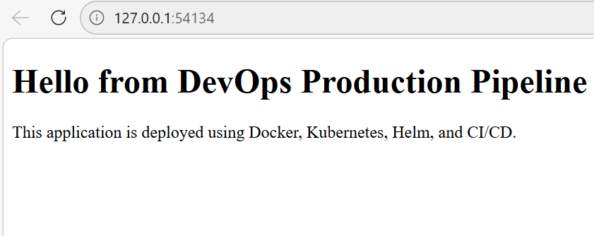

##DevOps Production Pipeline

Dockerized application deployed on Kubernetes with automated CI/CD pipeline using GitHub Actions, Helm, Docker Hub, and monitoring with Prometheus and Grafana.

Project Highlights

Containerized application using Docker

Kubernetes deployment with scaling and self healing

CI/CD pipeline using GitHub Actions

Docker image pushed to Docker Hub

Helm used for packaging and deployment

Monitoring implemented using Prometheus and Grafana

## Architecture

User → Kubernetes Service → Pods → Docker Container (Nginx App)
## Technology Stack

- Docker
- Kubernetes
- Minikube
- Helm
- GitHub Actions
- Docker Hub
- Prometheus
- Grafana
- Nginx
## Project Features

- Dockerized web application
- Kubernetes deployment with multiple replicas
- Service exposure using NodePort and ClusterIP
- Self healing and scaling demonstration
- CI/CD automation with GitHub Actions
- Helm based deployment management
- Monitoring with Prometheus and Grafana
### 1. Start Minikube

```bash
minikube start
```
## Application Running in Kubernetes

The application is deployed to Kubernetes and exposed via a service.


### 2. Build Docker Image
```bash
docker build -f docker/Dockerfile -t devops-pipeline-app .
```
### 3. Deploy using Helm
```bash
helm install devops-app ./helm/devops-app
```

### 4. Verify Deployment
```bash
kubectl get pods
kubectl get svc
```
### 5. Access Application
```bash
C:\minikube\minikube.exe service devops-app --url
Application Running in Kubernetes
```

## Helm Deployment

Helm is used to package and deploy the Kubernetes application.
```bash
helm install devops-app ./helm/devops-app
```
```md
## CI/CD Pipeline

GitHub Actions automates:

- Docker image build
- Image push to Docker Hub

Workflow location:

.github/workflows/
## Monitoring

Monitoring is implemented using Prometheus and Grafana.

### Access Grafana

```bash
C:\minikube\minikube.exe service monitoring-grafana --url
```

## Grafana Features

Kubernetes cluster monitoring

CPU and memory visualization

Pod and node metrics
## Project Roadmap

- Implement ArgoCD for GitOps deployment
- Add advanced Helm configurations (values per environment)
- Improve CI/CD with automated testing stage
- Enhance monitoring with custom Grafana dashboards
