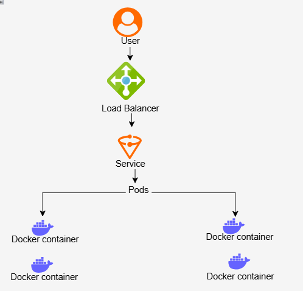

# DevOps Production Pipeline


## Project Highlights

- End-to-end DevOps pipeline implementation
- Containerized application deployed on Kubernetes
- CI/CD automation using GitHub Actions
- Real-world troubleshooting and scaling scenarios
Dockerized application deployed on Kubernetes with automated CI/CD pipeline using GitHub Actions and Docker Hub.

---

## Project Overview

This project demonstrates how to build, containerize, and deploy a web application using a complete DevOps workflow.

It covers:

- Docker image creation
- Kubernetes deployment using Minikube
- Service exposure using NodePort
- CI/CD pipeline using GitHub Actions
- Container image push to Docker Hub

---

## Architecture



---

## Technology Stack

- Docker
- Kubernetes
- Minikube
- kubectl
- GitHub Actions
- Docker Hub
- Nginx

---

## Project Features

- Dockerized web application
- Kubernetes deployment with multiple pods
- Service exposure using NodePort
- Application scaling demonstration
- Kubernetes self-healing test
- Automated CI/CD pipeline with GitHub Actions

---

## Quick Start

### 1. Start Minikube
```bash
minikube start
```
## Live Demo

After deployment, access the application using:

```bash
minikube service nginx-service
```
This will open the application in your browser.
### 2. Build Docker Image
```bash
docker build -f docker/Dockerfile -t devops-pipeline-app .
```
### 3. Deploy to Kubernetes
```bash
kubectl apply -f k8s/deployment.yaml```
kubectl apply -f k8s/service.yaml
```
### 4. Verify Pods
```bash
kubectl get pods
```
### 5. Access the Application
```bash
minikube service nginx-service
```
## Application Running in Kubernetes

The application is deployed to a local Kubernetes cluster using Minikube and exposed through a Kubernetes Service.
## CI/CD Pipeline

This project uses GitHub Actions to automate the deployment workflow.

Pipeline stages:

- Build Docker image
- Push image to Docker Hub
- Prepare for Kubernetes deployment

Workflow file:

```bash
.github/workflows/docker-build.yml
```

## Project Roadmap

Planned improvements:

Add Helm charts for packaging Kubernetes deployments

Implement ArgoCD for GitOps deployment

Integrate Prometheus for monitoring

Add Grafana dashboards

Improve CI/CD pipeline with testing and validation

Add troubleshooting and operational documentation
```md
## Troubleshooting

### Pods stuck in ImagePullBackOff

Ensure your Docker image is available locally:

```bash
minikube image load devops-pipeline-app
Port already in use

Run container on a different port:
docker run -p 8081:80 devops-pipeline-app
```
## Check pod logs
kubectl logs <pod-name>
## Restart deployment
kubectl rollout restart deployment devops-pipeline-app
```md
```
## What I Learned

- How to containerize applications using Docker
- How Kubernetes manages deployments and scaling
- How services expose applications inside a cluster
- How to debug common Kubernetes issues
- How to build a CI/CD pipeline using GitHub Actions
- How to push and manage images in Docker Hub